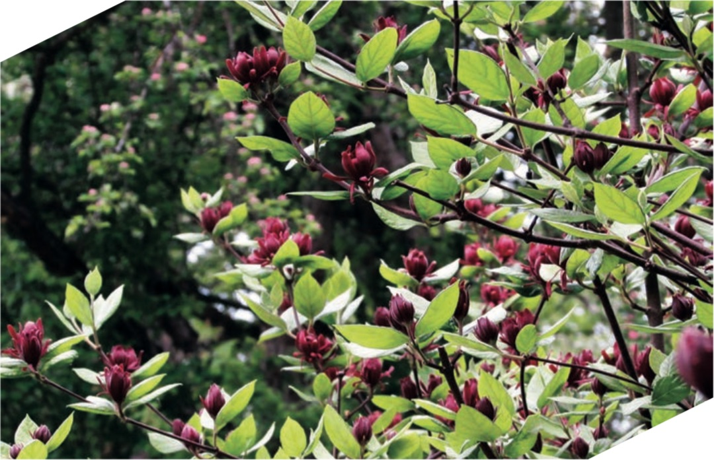
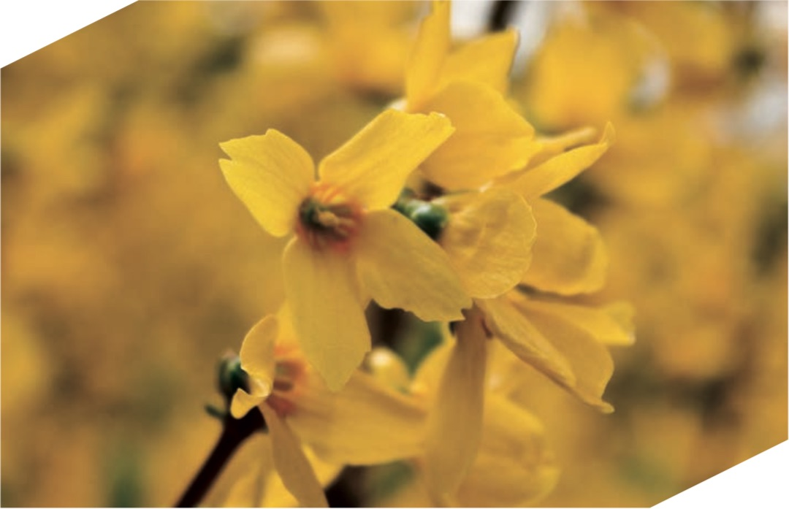

# Trees and Shrubs #

## WANT OF VARIETY A BLEMISH ##

THERE IS A SAD WANT of variety amongst evergreen and deciduous shrubs in the average English garden. Faith is placed in a few shrubs with a reputation for robbing the soil of its goodness and making a monotonous ugly green bank, neither pleasant to look at nor of any protective value. As one who knows shrubs well and the way to group them says, "Even the landscape gardeners, the men who have the making of gardens—with, of course, notable exceptions—do not seem to know the rich storehouse to draw from." Very true is this. We see evidence of it every day. The mixed shrubbery is fondly clung to as a place for all shrubs, whether flowering or otherwise, and the result is a thicket of growths, a case indeed of a survival of the fittest. There are other shrubs than Privet in this fair world of ours, and as for providing shelter, the wind whistles through its bare stems and creates a draught good for neither man, beast, nor plant. Of the cherry laurel again there is far too much in gardens. Few other plants can stand against its greedy, searching roots, and its vigorous branches and big leaves kill other leaf-growth near them. Grown in the proper way, that is, as an isolated shrub, with abundance of space to develop its graceful branches and brilliant green leaves, the Cherry Laurel is a beautiful evergreen; it is quite happy in shady, half-wooded places. But grown, as it is so often, jammed up and smothering other things, or held in bounds by a merciless and beauty-destroying knife, its presence has not been to the advantage of English gardening.

When the planting season comes round, think of some of the good shrubs not yet in the garden, and forget pontic Rhododendron, Laurel, Aucuba, and Privet. By this is not meant rare shrubs, such as may only be had from the few nurseries of the very highest rank or from those that make rare shrubs a speciality, but good things that may be grown in any garden and that appear in all good shrub catalogues.

Perhaps no beautiful and now well-known shrub is more neglected than beautiful Exochorda grandiflora (the Pearl Bush). Its near relatives, the Spiræas, are in every shrubbery, but one may go through twenty and not see Exochorda. Even of the Spiræas one does not half often see enough of S. Thunbergi, a perfect milky way of little starry bloom in April and a most shapely little bush, or the double-flowered S. prunifolia, with its long wreaths of flower-like double thorn or minute white roses and its autumn bravery of scarlet foliage. The hardy Magnolias are not given the opportunity they deserve of making our gardens lovely in earliest summer. Who that has seen Magnolia stellata in its April dress of profuse white bloom and its summer and autumn dignity of handsome though not large foliage, would endure to be without it? or who would not desire to have the fragrant chalices of M. soulangeana, with their outside staining of purple, and M. conspicua, of purest white in the early months of March and April? And why does not every garden hold one, at least, of the sweet Chimonanthus, offering, as it does in February, an abundance of its little blooms of a fragrance so rich and powerful that it can be scarcely matched throughout the year?

Cassinia fulvida, still known in nurseries by its older name of Diplopappus, in winter wears its fullest dress of tiny gold-backed leafage in long graceful sprays, that are borne in such profusion that they only beg to be cut to accompany the rare flowers of winter that we bring indoors to sweeten and enliven our rooms.

Of small-flowering trees none is lovelier than the Snowy Mespilus (Amelanchier), and for a tree of somewhat larger size the good garden form of the native Bird Cherry is beautiful in the early year. The North American Halesia (the Snowdrop Tree) should be in every garden, either as a bush or tree, every branch hung in May with its full array of pendent bloom of the size and general shape of Snowdrops, only of a warm and almost creamy instead of a cold snow-white colour.

Few spring-flowering shrubs are more free and graceful than Forsythia suspensa, and if it can be planted on a slight eminence and encouraged to throw down its many-feet-long graceful sprays it then exhibits its best garden use. The Chinese Viburnum plicatum is another shrub well known but unfairly neglected, flowering with the earliest Irises. Grouped with the grand Iris pallida dalmatica it is a thing never to be forgotten.

  
*Calycanthus floridus, with its spice-scented blooms, is a lovely addition in a fine, cool, well-sheltered corner.*

Æsculus (Pavia) parviflora, blooming in July when flowering shrubs are rare, is easily grown and strikingly handsome, and yet how rarely seen! Calycanthus floridus, with its spice-scented blooms of low-toned crimson, also a late summer flower, is a fine thing in a cool, well-sheltered corner, where the sun cannot burn the flowers. The Rose Acacia (Robinia hispida), trained on a wall or house, is as beautiful as any Wistaria, and the quality of the low-toned rosy bloom of a much rarer colour. It is quite hardy, but so brittle that it needs close and careful wall training or other support. To name a few others in the same kind of category, but rather less hardy, the Sweet Bay is the noblest of evergreen bushes or small trees; the Tamarisk, with its grey plumes of foliage and summer flower-plumes of tenderest pink, is a delightful plant in our southern counties, doing especially well near the sea. Clethra alnifolia, against a wall or in the open, is a mass of flower in late summer, and the best of the Hibiscus syriacus, or Althæa frutex, the shrubbery representatives of Mallows and Hollyhocks, are autumn flowers of the best class. A bushy plant of half-woody character that may well be classed among shrubs, and that was beloved of our grandmothers, is Leycesteria formosa, a delightful thing in the later autumn. The large-fruited Euonymus (Spindle Tree) is another good thing too little grown.

For a peaty garden there are many delightful plants in the neglected though easy-to-be-had list. One of these is the beautiful and highly fragrant Azalea occidentalis, all the better that the flowers and leaves come together and that it is later than the Ghent Azaleas. Then there are the two sweet-scented North American Bog Myrtles, Myrica cerifera and Comptonia asplenifolia, the charming little Leiophyllum buxifolium, of neatest bushy form, and the Ledum palustre, whose bruised leaves are of delightful aromatic fragrance; Vaccinium pennsylvanicum, pretty
in leaf and flower and blazing scarlet in autumn, and Gaultheria Shallon, a most important sub-shrub, revelling in moist peat or any cool sandy soil.

These examples by no means exhaust the list of desirable shrubs that may be found for the slightest seeking. This brief recital of their names and qualities is only meant as a reminder that all these good things are close at hand, while many more are only waiting to be asked for.

## ORNAMENTAL PLANTING IN WOODLAND ##

WHERE WOODLAND ADJOINS GARDEN GROUND, and the one passes into the other by an almost imperceptible gradation, a desire is often felt to let the garden influence penetrate some way into the wood by the planting within the wood of some shrubs or trees of distinctly ornamental character.

Such a desire very naturally arises—it is wild gardening with the things of larger growth; but, like all forms of wild gardening (which of all branches of gardening is the most difficult to do rightly,
and needs the greatest amount of knowledge), the wishes of the planter must be tempered with extreme precaution and restraint. It does not do to plant in the wild garden things of well-known garden character. This is merely to spoil the wood, which, in many cases, is already so good that any addition would be a tasteless intrusion of something irrelevant and unsuitable.

Still, there are certain wooded places where a judicious planting would be a gain, and there are a certain number of trees and shrubs which those who have a fair knowledge of their ways, and a true sympathy with the nature of woodland, recognise as suitable for this kind of planting. They will be found in these classes: Native growths that are absent or unusual in the district, such as the Spindle Tree (Euonymus), White Beam, Service Tree, White and Black Thorn, Wild Cherry, Bird Cherry, Wild Guelder Rose (Viburnum Opulus), and V. Lantana, Honeysuckle, Wild Roses, Juniper, and Daphne Laureola.

Then, among cultivated trees and shrubs, those that are nearly related to our wild kinds, including some that are found in foreign woodlands that have about the same latitude and climate as our own. Among these will be Quinces and Medlars, many kinds of ornamental Cratægus, Scarlet Oaks, various Elders and Crabs, and the grand Pyrus americana, so like our native Mountain Ash, but on a much larger scale.

A very careful planting with trees and shrubs of some of these and, perhaps, other allied kinds, may give additional beauty and interest to woodland. Differences of soil will, of course, be carefully considered, for if a piece of woodland were on chalky soil, a totally different selection should be made from one that would be right for a soil that was poor and sandy.

In moist, sandy, or, still better, peaty ground, especially where there is a growth of Birches and Scotch Firs, and not many other kinds of trees, a plantation of Rhododendrons may have a fine effect. But in this case it is better to use the common R. ponticum only, as a mixture of differently coloured kinds is sure to give a misplaced-garden look, or an impression as if a bit of garden ground had missed its way and got lost in the wood.

## GROUPING OF TREES AND SHRUBS ##

THIS SUBJECT WERE CONSIDERED with only a reasonable amount of thought, and the practice of it controlled by good taste, there is nothing that would do more for the beauty of our gardens or grounds. Nothing can so effectually destroy good effect as the usual senseless mixture of deciduous and evergreen shrubs that, alas! is so commonly seen in gardens—a mixture of one each of a quantity of perhaps excellent things planted about three feet apart. There would be nothing to be said against this if it were the deliberate intention of any individual, for, as a garden is for the owner's happiness, it is indisputably his right to take his pleasure in it as he will, and if he says, "I have only space for a hundred plants, and I wish them to be all different," that is for him to decide. But when the mixture is made from pure ignorance or helplessness it is then that advice may be of use, and that the assurance may be given that there are better ways that are just as easy at the beginning, and that with every year will be growing on towards some definite scheme of beauty, instead of merely growing up into a foolish tangle of horticultural imbecility.

If the intending planter has no knowledge it is well worth his while to take advice at the beginning, not to plant at random and to feel, a few years later, first doubt, and then regret, and then, as knowledge grows, to have to face the fact that it is all wrong and that much precious time has been lost.

How to group is a large question, depending on all the conditions of the place under consideration. Whether a group is to be of tall or short growing shrubs or trees, whether it is to be of three or three hundred, and so on. The knowledge that can answer is the knowledge of gardening of the better kind. The whole thing should be done carefully on paper beforehand, or there will again be repented the error of huddled single plants. The groups will have to be well shaped and well sized and well related to each other and all that is near, or they may be merely a series of senseless blocks, not intelligently formed groups at all.

*Single plants, such as the Forsythia suspensa, look most striking when planted against dark, well-formed shrub groupings.*

Then, in proper relation to the groups, single plants can be used with the best possible effect, as, for instance, a snowy Mespilus or a Cherry or a Pyrus floribunda against a dark massing of Yew or Holly; or a Forsythia suspensa casting out its long flowering branches from among bushes of Berberis. Then the fewer individuals will have their full value, while the larger masses will have dignity even when in leaf only, and their own special beauty
at the time when they are in flower or fruit. For some flowering and fruiting bushes are best grouped, while a few are best seen standing alone, and it is only knowledge of good gardening that can guide the designer in his decisions on these points. Still it does not follow that a shrub or flowering tree cannot be used both for groups and single use, for such an one as the Forsythia just mentioned is also of charming effect in its own groups, with the red-tinted Berberis or the quiet-coloured Savins, or whatever be the lower growing bushy mass that is chosen to accompany it. Every one can see the great gain of such arrangements when they are made, but to learn to make them, and even to perceive what are the plants to group together, and why, that is the outcome of the education of the garden artist.

In the Royal Gardens, Kew, the best of plants may be seen and, to a considerable degree, the best ways of using them in gardens.

The one-thing-at-a-time planting is always a safe guide, but as the planter gains a firmer grasp of his subject, so he may exercise more freedom in its application. Nearly every garden, shrubbery, and ornamental tree plantation is spoilt or greatly marred by too great a mixture of incongruous growths. Nothing wants more careful consideration. On the ground in the open air, and sitting at home quietly thinking, the question should be carefully thought out. The very worst thing to do is to take a nursery catalogue and make out from it a list of supposed wants. The right thing is to make a plan of the ground, to scale, if possible, though a rougher one may serve, and mark it all down in good time beforehand, not to wait until the last moment and then mark it; and not to send the list to the nursery till the ground is well forward for planting, so that the moment the plants come they may go to their places.

All this planning and thinking should be done in the summer, so that the list may go to the nursery in September, which will enable the nurseryman to supply the trees in the earliest and best of the planting season.

How good it would be to plant a whole hill-side on chalky soil with grand groupings of Yew or Box, or with these intergrouped, and how easy afterwards to run among these groupings of lesser shrubs; or to plant light land with Scotch Fir and Holly, Thorn and Juniper (just these few things grouped and intergrouped); or wastes of sandhills near the sea within our milder shores with Sea Buckthorn and Tamarisk, and Monterey Cypress (Cupressus macrocarpa), and long drifts of the handsome Blue Lyme Grass.

A mile of sandy littoral might be transformed with these few things, and no others than its own wild growths, into a region of delight, where noble tree form of rapid growth, tender colour of plume-like branch and bloom and brilliant berry, and waving blue grassy ribbons, equalling in value any of the lesser Bamboos, would show a lesson of simple planting such as is most to be desired but is rarely to be seen.

The other and commoner way is nothing but a muddle from beginning to end. A van-load of shrubs arrives from the nursery— one of each or perhaps not more than six of any kind. No plan is prepared, and the trees and shrubs are planted in the usual weary mixture, without thought or design. Generally there are three times too many for the space. It is a cruel waste and misuse of good things.

第1章

　　卫来被冻醒的刹那，脑子里掠过一个念头：老子受够了，今天就南归！
　　这是他在北极圈内度过的第四个月，彼时，他已经从北冰洋周边撤回到了拉普兰地区的密林，蜷缩在原住民萨米人废弃的一间kota（帐篷）内，帐篷跟印第安人的毡帐很像，尖顶圆锥，四围蒙摞补密叠的驯鹿皮、熊皮、毛毡御寒。他裹了兽皮，躺在半尺来厚的灰烬层中，睡前烧了篝火，躺下的时候犹有暖意，现在伸手去摸，灰烬都冷成了咬人的嘴，冷不丁咬上一口，半只手臂凉到发麻。
　　是该南归了，四个月，尤其是后半程，见过的人不超过一个巴掌，据说长期在极端环境中独自生活的人会出现幻象：昨天，他确信自己看到了一只驯鹿盘腿坐在地上抹口红，口红的品牌是香奈儿，色号99，正红，驯鹿抹完之后，扭头朝他嘟着嘴，像在索吻。
　　卫来居然还对它的妆容做了点评：“你该打个唇线。”
　　说完就抱着脑袋蹲了下去，再不走，大概精神就要出问题了。
　　他裹紧兽皮，从kota里钻出来，一夜风雪，这一刻出奇安静，半天上一道鬼魅幽碧的极光，蛇行样扭曲进橘红色铺天盖地的霞，高大的赤松被一层一层的冰雪塑形、压低头、压弯腰，个个身材臃肿，像巨人、妖灵、排列到天尽头处的森森白骨。
　　萨米人相信，天上有一只火狐狸，它在夜空奔跑，用尾巴拍打雪花，于是出现了极光。
　　而在中国人看来，天现异彩，那叫祥瑞之气。
　　国人做事讲究，安门纳采、驾马造屋都爱取个好日子——决定南归的这一天，满天祥瑞，意头不错。
　　——
　　踩着齐膝深的雪，卫来一路向南，徒步走出拉普兰森林，运气好的时候，会搭到一程哈士奇狗拉的雪橇。
　　松了那口绝不能死在雪原的气，生物钟开始紊乱，精神时刻恍惚，像生育过的女人一孕傻三年，说话做事云里雾里，三餐在粗糙的披萨饼、过时的意大利餐和驯鹿肉冰啤间来回切换，回到首都赫尔辛基的时候，他能清晰记得的，只有两件事。
　　一是，路过罗瓦涅米的圣诞老人村时，他对着标志北极圈的灯柱鞠了个躬，好像还说了声再见，有游客避在一边偷窥他，他听到有人评论他是野人。
　　二是，搭了一辆满载挪威云杉的拖木大货车，芬兰号称是五百万伐木工的国度，这样的拖木车很常见——驾驶室里不够坐，他裹着兽皮翻进车后斗，在刺鼻的树木气味间躺倒，后半夜的时候司机上来拍打他，大意是只能送到这了，他听见了，但困地睁不开眼，也没起身，含糊地说：“那把我扔在这就行。”
　　司机没办法，招呼了同伴，一个抬头一个抬脚，抛尸一样把他扔在路边，他半张脸贴着泥，一觉睡到天亮。
　　不过，回到赫尔辛基，远远望见高处乳白色路德宗教堂的时候，他一下子回血了。
　　耳聪、目明、思维敏捷，鼻子能嗅到远处刚出炉肉堡的味道，血管里的血也像边上桑拿房里的滚水，开始翻沸。
　　回到老地方了，有人讨厌这里，觉得它清冷、黯淡，像“实施开放政策前的苏联”，有人喜欢这里，觉得这个被波罗的海环拥的城市有着田园般的诗情画意。